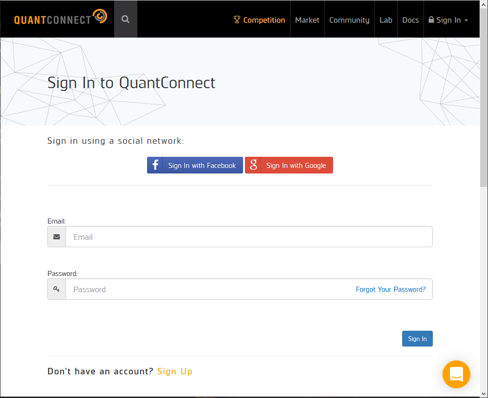
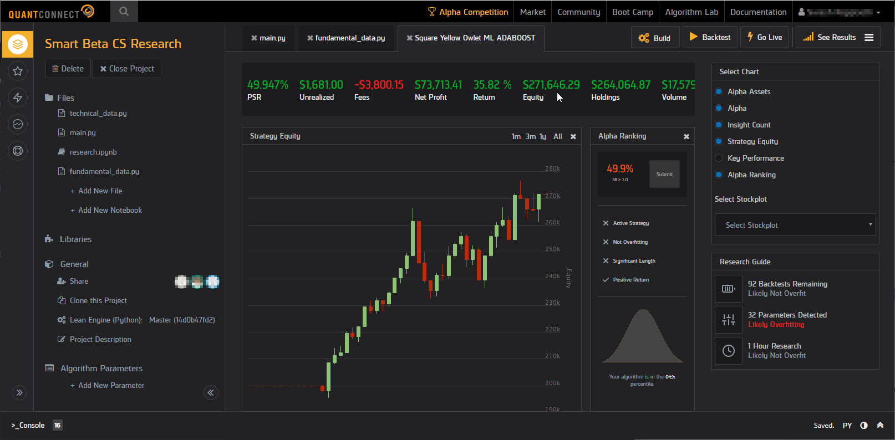

# Table of contents
- [Introduction](#introduction)
  * [Code Organization](#code-organization)
  * [Environment](#environment)
    + [Cloud](#cloud)
    + [Desktop](#desktop)
- [Implementation](#implementation)
  * [Smart Beta Strategy](#smart-beta-strategy)
  * [Tick Data Strategy](#tick-data-strategy)
    + [Data Download](#data-download)
    + [Data Preprocess](#data-preprocess)
- [QuantConnect Primer](#quantconnect-primer)

# Introduction
This repo contains the implementation of the WorldQuant University's Capstone project submitted by:
1. Mikhail Shishlenin
2. Ganesh Harke and
3. Suresh Koppisetti

## Code Organization
This project is accomplished by extending the QuantConnect's framework to implement a smart beta algorithm. The source code can be found under the <code>src</code> folder. Below is the structure of the code organization:

<pre>
requirements.txt
src
|__ smart_beta_strategies
|   |__ run_config.py
|   |__ main.py
|   |__ fundamental_data.py
|   |__ technical_data.py
|   |__ algo_type.py
|__ tick_data_strategies
    |__ QCTickDataStrategy.py
    |__ 1_get_tick_data.py
    |__ 2_preprocess_ticks.py
    |__ 3_create_adj_ticks.py
    |__ 4_dollar_bars_triple_barrier_indicators.py
    |__ data
        |__ 1_RawTicks
        |   |__ GAZP
        |       |__ GAZP_090103_090111.csv
        |__ 2_MOEX
        |   |__ RI.IMOEX_090101_191213.csv
        |__ 3_Dividends
        |   |__ GAZP.ME.csv
        |__ 4_DollarBars
        |   |__ GAZP_10_dollar_bars.csv
        |__ 5_Indicators
            |__ GAZP_10_0.1_indicators.csv
</pre>

## Environment
### Cloud
As mentioned above, as part of the research for our project, we have used the QuantConnect platform. QuantConnect provides its framework to write our own algorithms either on the cloud at https://www.quantconnect.com/terminal/ or by downloading and using the QuantConnect's Lean engine locally. In either case, the implementation remains pretty much the same. We performed most of our analysis on the cloud because of the availability of large US equity datasets. We have also used the local Lean engine to test the custom dollar bars we generated using the tick data we obtained for some stocks on Russian stock exchange.

### Desktop
For some parts of this project we also need a local Python environment. To create python environment one needs to use **anaconda**. The ```requirements.txt``` lists all the Python packages that we have used for the purpose of this research. The script below sets up the environment. This environment will be used for running Python scripts in our **Tick Data Strategies** as well as the QuantConnect's **LEAN** (desktop) Engine.

> Note: This environment should be built on Python version 3.6.

``` bash
> conda create --name QC python=3.6.6
> conda activate QC
> pip install -r requirements.txt
```

# Implementation
## Smart Beta Strategy
As part of our research we have implemented a Smart Beta algorithm which leverages the QuantConnects framework. Below is the class diagram of the implementation:


This particular strategy is implemented on QuantConnect's **AlgorithmLab** environment. The starting point for any algorithm developed on the QuantConnect's framework is a class which implements the **```QCAlgorithm```** base class. The **```QCAlgorithm```** provides various lifecycle hook methods which can be overridden to perform specific tasks like asset selection, trade actions, rebalancing etc.,

As shown in the class diagram above, SmartBetaStrategies in ```main.py``` is the startup class whose ```Initialize()``` method is called by the QuantConnect framework upon starting the backtesting. In the ```Initialize()``` method, a common pattern you will notice is the registration of various functions with the framework to be called at specific instance during the backtesting. For example, we register two functions ```CoarseSelectionFunction()``` and ```FineSelectionFunction()``` are register which are invoked by the framework when selecting securities from the universe of securities for backtesting. Another important function is the ```Rebalance()``` and ```RebalanceOnML()``` functions which as the name suggests, will be invoked by the framework when it's time for rebalancing the portfolio during the backtesting. 

## Tick Data Strategy
Tick Data Strategy is our attempt at getting raw tick data to generate price bars ourselves. Since tick data is hard to comeby, we have scoured and obtained tick data for securities listed on the Moscow Exchange. Before consuming this raw data, we needed to preprocess the data. The following section describes the process we followed:

### Data Download
The data download script was tested on Ubuntu 18.04 and MacOs (Mojave, Catalina) with FireFox browser.

To download the data one required to have ```Selenium webdriver``` installed. Instructions for that could be found [here](https://selenium-python.readthedocs.io/installation.html#drivers)

Among blue chips and MOEX index constituents the following assets were chosen for the analysis:
'AFKS', 'ALRS', 'CHMF', 'GAZP', 'GMKN', 'LKOH', 'MGNT', 'MTSS', 'NVTK', 'ROSN', 'RTKM', 'SBER', 'SNGS', 'TATN', 'VRBR', 'YNDX'

To start downloading process one needs to run ```1_get_tick_data.py``` from command line with the arguments ```symbol```, ```start date``` and ```end date``` in the ```YYYY-MM-DD``` format.

```> python.py 1_get_tick_data.py GAZP 2009-01-01 2019-12-13```

After the algorithm opens the firefox window, the frequency of the data ('ticks') and the output format ('.csv') need to be selected manually. In addition, one needs to select 'save to file' and select a checkbox 'repeat for the next occurrences'. All this need to be done once.

Algorithm will download chunks of data in ```.csv``` files withing size limit of around 41.6Mb into folders named by symbol into ```1_RawTicks``` folder.

This web-site _does not_ provide data to download every day from 7:00am to 3:00pm GMT.

Alternately, raw tick data for this research can be reached in [Box folder](https://app.box.com/s/fwau5uwsrvn4lgwfwpvkf9zwnxo24k82)

### Data Preprocess
The Data Processing scripts preprocess raw tick data to create dollarbars and indicators (features) for feeding ML algorithm.

1. Run ```2_preprocess_ticks.py``` to save data within single parquet file in the folder ```2_Ticks``` for each company.

2. Adjust tick data backward to dividends paid - see [formula](https://help.yahoo.com/kb/SLN28256.html). Dividends data is manually downloaded from 'finance.yahoo.com' and saved to the folder ```3_Dividends```. Run ```3_create_adj_ticks.py``` for adjusting and saving data into the folder ```3_AdjTicks```.

3. The last preprocessing script ```4_dollar_bars_triple_barrier_indicators.py``` which creates dollarbars and saves them into folder ```4_DollarBars```, then creates data series to feed trading algorithm and saves them into folder ```5_Indicators```. The dollarbars and indicators are built based on input parameters, that could be changed for modelling variations.

### Running Algos
Trading algorithm is developed to run within open source QuantConnect platform. Trading algorithm could be executed on the web [QuantConnect](https://www.quantconnect.com) service or locally on the underlying [LEAN Engine](https://github.com/QuantConnect/Lean/tree/master/Algorithm.Python#quantconnect-python-algorithm-project).

- To run it with QuantConnect platform one needs to login, 'Create new Algorithm' within 'Algorithm Lab' (or 'Lab'), and substitute the code by the code from 'QCTickDataStrategy.py'. This script contains links to dropbox folders with already created 'Indicators' files, which can be substituted by the files you created at the 'Data Preprocess' step above. After starting 'Backtest', QuantConnect will generate statistics and reports. (This scripts were tested under PRO account and could be running slowly under free account).

- To run algorithm locally, one needs to have Visual Studio and python environment, which was created at the first step. Details on installation, compiling and running algorithm are available [here](https://medium.com/hackernoon/setting-up-your-own-algorithmic-trading-server-4bbdf0766c17). In this step the dropbox links to files with indicators can be substituted to local file links.


# QuantConnect Primer
Following is a quick primer on how to use QuantConnect. To run the **Smart Beta Fundamental** strategies, the user need to follow the steps shown below:
1. **Login:** Open Web a browser and go to https://www.quantconnect.com/login?target=Web. You will see QuantConnect login page. Please enter the _User Name_ and _Password_ that are provided to you.
Fig: QuantConnect Login


2. **Explore AlgorithmLab:** You will then be taken to the **AlgorithmLab** dashboard as shown in the screenshot below. On this screen notice the outlined sections. All the projects that are shared with you will be visible which you can click to check the source code for the algorithms.
Fig: AlgorithmLab Dashboard


3. **Explore and Edit a Project:** Clicking on any of the projects opens the Project explorer along with the code Editor as shown in the screenshot below.
Fig: Project Explorer and Editor


4. **Run Backtesting:** To run the backtesting, we need to click the **Backtest** button that is outlined in the screenshot above.

5. **Explore the Results:** To explore the results, click on the **Results** button to slide the results dashboard. You will see all the pre run results in the grid. If you are currently running any backtest, this grid will show the status of the current backtest with the progress indicators. Clicking on any of the existing results opens a new tab on the code editor screen with the results.
<br>Fig: Backtest Results Dashboard

Fig: Backtest Results


